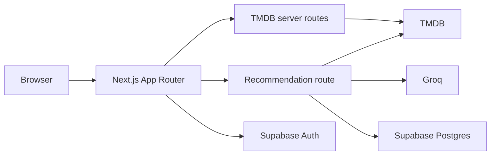

# Cinemotion — AI Movie & Series Discovery

Cinemotion is a full-stack movie and TV discovery app that combines fast browsing with personalized AI recommendations. Users can search and explore public content, then sign in to receive up to three free recommendations and save their recommendation history.

**[Live demo](https://movies-tv-app-with-ai.vercel.app)** · **[View the source](https://github.com/abdelrhmanehab10/movies-tv-app-with-ai)**

## Why this project

Cinemotion was built as a product-focused portfolio project, not just an API demo. It covers the parts of a real application that are easy to overlook:

- Public browsing with search, pagination, media details, and shareable URL state
- A guided recommendation flow using mood, story type, and setting
- Authentication, protected history, and row-level database security
- An atomic per-user quota for three free AI recommendations
- Server-side provider credentials and clear failure handling
- Responsive UI states for loading, empty results, provider errors, and retry

## Product flow

1. Browse popular, top-rated, currently playing, or upcoming movies.
2. Search movies or TV series and move through paginated results.
3. Open a title to view its details, genres, overview, release information, and artwork.
4. Sign in when ready to use the recommendation flow.
5. Choose a quick vibe or tune the mood, story type, and setting manually.
6. Receive an AI-generated pick resolved against TMDB, then save successful recommendation history.

## Architecture



### Engineering decisions

| Concern | Approach | Why it matters |
| --- | --- | --- |
| Provider security | TMDB, Groq, and Supabase service credentials stay in server-only code | Secrets never need to reach the browser |
| Recommendation quota | An atomic Postgres claim function limits each authenticated user to three free picks | Concurrent requests cannot bypass the limit |
| Failed provider calls | A successful quota claim is refunded when the recommendation provider fails | Users do not lose a pick because of an upstream outage |
| Authentication | Supabase SSR clients, cookie refresh middleware, and RLS policies | Sessions and user-owned history work across server and browser boundaries |
| Input validation | Zod schemas validate form input and TMDB route parameters | Invalid requests fail before reaching external providers |
| Client resilience | Loading, empty, error, retry, and persisted-result states are handled explicitly | Provider failures do not leave the interface stuck |

## Features

- AI-assisted movie and series recommendations through Groq and TMDB
- Movie and TV search with URL-based query state and pagination
- Popular, top-rated, now-playing, and upcoming movie browsing
- Detail pages with metadata and responsive artwork
- Quick recommendation presets and advanced preference selection
- Supabase email authentication and account creation
- Recommendation history stored in Postgres with row-level security
- Three free AI recommendations per authenticated user
- Versioned browser persistence for the latest recommendation
- Responsive Tailwind CSS interface with explicit loading, empty, and error states

## Tech stack

**Frontend:** Next.js 15, React 18, TypeScript, Tailwind CSS, Radix UI, Zustand

**Forms and validation:** React Hook Form, Zod, `@hookform/resolvers`

**Backend and data:** Next.js route handlers, Axios, Supabase Auth, Supabase Postgres, PostgreSQL functions

**External services:** Groq API and TMDB API

**Quality:** ESLint 9 flat config, Vitest, Supabase CLI, TypeScript

## Run locally

### Prerequisites

- Node.js 18 or newer
- pnpm
- A Groq API key
- A TMDB API key or v4 read access token
- A Supabase project for authentication and persistence

### Installation

```bash
git clone https://github.com/abdelrhmanehab10/movies-tv-app-with-ai.git
cd movies-tv-app-with-ai
pnpm install
```

Create `.env.local` from `.env.example`:

```env
GROQ_API_KEY=your_groq_api_key
GROQ_MODEL=openai/gpt-oss-20b
TMDB_API_KEY=your_tmdb_api_key_or_read_access_token
NEXT_PUBLIC_IMAGE_URL=https://image.tmdb.org/t/p/w500
NEXT_PUBLIC_SUPABASE_URL=https://your-project-ref.supabase.co
NEXT_PUBLIC_SUPABASE_PUBLISHABLE_KEY=your_supabase_publishable_key
SUPABASE_SERVICE_ROLE_KEY=your_supabase_service_role_key
```

`NEXT_PUBLIC_IMAGE_URL` is optional. `TMDB_API_KEY`, `GROQ_API_KEY`, and `SUPABASE_SERVICE_ROLE_KEY` are server-only values and must never use a `NEXT_PUBLIC_` prefix or be committed.

Apply the Supabase migrations to a linked project:

```bash
pnpm supabase login
pnpm supabase link --project-ref your-project-ref
pnpm supabase db push
```

Start the development server:

```bash
pnpm dev
```

Open [http://localhost:3000](http://localhost:3000).

## Quality checks

```bash
pnpm lint
pnpm test
pnpm build
```

The database concurrency suite requires Docker and a running local Supabase stack:

```bash
pnpm supabase start
pnpm test:db
```

## Project structure

```text
app/
├── (auth)/                 # Sign-in and account creation
├── (main)/                 # Browse, search, and recommendation UI
├── api/recommend/          # Groq + TMDB recommendation route
├── api/tmdb/               # Server-only TMDB browse routes
├── auth/callback/          # Supabase auth callback
└── detail/                 # Media detail page
components/                 # Reusable UI and result components
hooks/                      # Zustand stores and shared hooks
lib/supabase/               # Browser, server, and middleware clients
supabase/migrations/        # Versioned schema and RLS policies
schemas/                    # Zod validation schemas
types/                      # Shared TypeScript types
```
